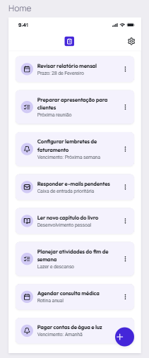
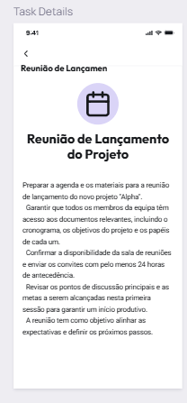

# 📱 Desafio Técnico: Lume Pocket

Este é o desafio técnico de preparação para a equipe de desenvolvimento do **Projeto LUME**.

**Objetivo:** Este não é um teste de aprovação ou reprovação. O objetivo é simular o fluxo de trabalho real que teremos no projeto principal, garantindo que todos estejam alinhados com os padrões de código, versionamento e entrega.

---

## 🎯 O Escopo do App

Você desenvolverá o **Lume Pocket**, um gerenciador de tarefas simplificado. O foco não é a complexidade visual, mas a estrutura e o funcionamento lógico.

### Funcionalidades
1.  **Tela Home (Lista):**
    * Exibir uma lista de atividades (Ex: "Estudar Widgets", "Daily Lume", "Configurar Ambiente").
    * **Técnica:** Obrigatório uso de `ListView.builder`.
    * **Interação:** Um botão flutuante (FAB) que adiciona um item novo à lista ao ser clicado (apenas atualização de estado local).
2.  **Tela de Detalhes:**
    * Ao clicar em um item da lista, navegar para uma segunda tela.
    * Exibir o título da atividade e uma descrição (texto fictício).
    * Botão de voltar para a Home.

---

## 🧐 Critérios de Avaliação (O que estamos olhando)

A qualidade da entrega será medida pelos seguintes pilares:

### 1. Organização e Conventional Commits (Peso Alto ⭐)
Não queremos apenas o código pronto. Queremos ver a **história** da construção do app através do Git.
* **Atomicidade:** Não faça um único commit com tudo pronto. Faça commits a cada funcionalidade ou componente criado.
* **Padrão Obrigatório:** Utilize o [Conventional Commits](https://www.conventionalcommits.org/pt-br).
    * `feat: adiciona estrutura da tela home`
    * `fix: corrige erro de overflow na lista`
    * `docs: atualiza readme com instruções`
    * `style: ajusta cores do card`

### 2. Estrutura de Projeto
Organize seu código separando responsabilidades. Exemplo sugerido:
```text
lib/
├── components/     # Widgets reutilizáveis (botões, cards)
├── models/         # Modelos de dados
├── screens/        # Telas (Home, Details)
└── main.dart       # Ponto de entrada
```
## 3. Entrega Final (Build)

Você deve provar que seu ambiente é capaz de gerar o aplicativo final para Android.

* O repositório deve conter o código fonte.
* Você deve gerar e disponibilizar o arquivo `.apk`.

## 🤖 IA Report (Obrigatório)

Assim como em desafios anteriores, você deve entregar um relatório sobre como utilizou a Inteligência Artificial.

Crie um arquivo `IA_REPORT.md` na raiz do projeto contendo:

* **Prompts:** O que você perguntou?
* **Contribuição:** Onde a IA ajudou mais (código, lógica, correção de erros)?
* **O que aprendeu:** O que você entendeu graças à explicação da IA?
* **Autoria:** Confirmação de que você testou e entendeu o código gerado.

## 📚 Material de Apoio

* **Roadmap de Estudos:** [https://github.com/Flutterando/Roadmap](https://github.com/Flutterando/Roadmap)
* **Conventional Commits:** [Guia Prático](https://www.conventionalcommits.org/pt-br/)

## 🚀 Como Entregar

### 1. Repositório
1.  Crie um repositório no seu GitHub.
2.  Suba o projeto seguindo os padrões de commit (Conventional Commits).
3.  O `IA_REPORT.md` deve estar na raiz do projeto.

### 2. O Executável (APK)
Você deve gerar a versão de instalação para Android. Para otimizar o tamanho do aplicativo, utilizaremos a divisão por arquitetura.

**Passo a passo:**

1.  No terminal, rode o comando:
    ```bash
    flutter build apk --split-per-abi
    ```
    *(Isso vai demorar um pouco mais que o normal, pois ele está compilando 3 versões diferentes).*

2.  Após finalizar, vá até a pasta:
    `[seu-projeto]/build/app/outputs/flutter-apk/`

3.  Você verá três arquivos APK lá:
    * `app-armeabi-v7a-release.apk` (Celulares mais antigos/32bits)
    * `app-arm64-v8a-release.apk` (Celulares modernos/64bits) 🟢 **(É ESSE AQUI)**
    * `app-x86_64-release.apk` (Emuladores)

4.  **Envie APENAS o arquivo `app-arm64-v8a-release.apk`.**
    * *Nota: Se você não souber onde está a pasta, pode clicar com o botão direito na pasta `build` no seu editor e escolher "Open in Explorer" ou "Reveal in Finder".*

---

## 🎨 Referência Visual (Layout)

Não esperamos um design digno de prêmio, mas a estrutura deve seguir o padrão **Material Design**.

Abaixo estão os protótipos de referência ("Mockups") do que esperamos visualmente. Usem como guia para posicionar os elementos (Cards, Textos, Botões).

### Tela 1: Home (Lista de Tarefas)
*Observem o uso do botão flutuante (FAB) e o espaçamento entre os cards.*


*(Se a imagem não carregar: imagine uma lista vertical onde cada item tem ícone, título e subtítulo, com um botão "+" no canto inferior direito)*

### Tela 2: Detalhes da Tarefa
*Observem o botão de voltar no topo e a hierarquia dos textos (Título grande, descrição menor).*



---


## 🚀 Boa sorte, estamos a disposição para tirar dúvidas!


